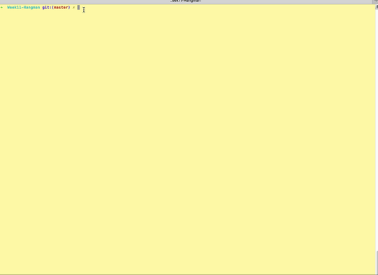

## Node Hangman - A Node.js Command line Hangman App. 

A Node.js Command line Hangman App that uses the Movie DB API to gather Actor names via user input then uses the name to create a Hangman game via the command line.

## Usage

1. Clone repo
2. npm install
3. cd Hangman
4. `node main.js`
5. Follow game instruction and prompts.
6. Enter an actors first name only.
7. Once actors name has been entered App will grab several movies the actor has been in and use one for the user to guess via cmd line for the Hnagman game. 
6. ENJOY! 

## Contributing

1. Fork it!
2. Create your feature branch: `git checkout -b my-new-feature`
3. Commit your changes: `git commit -am 'Add some feature'`
4. Push to the branch: `git push origin my-new-feature`
5. Submit a pull request :D

## Tech Used 

* Node.js
* JavaScript
* NPM MovieDB
* NPM Inquirer
* NPM Request
* Ajax
* APIs

## License

N/A
